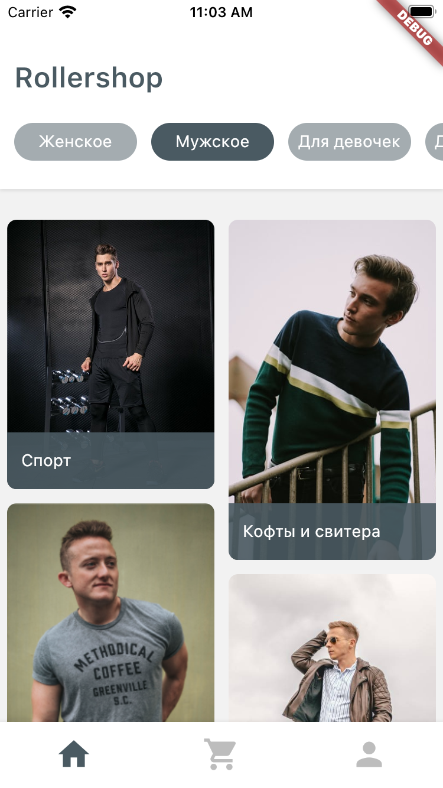
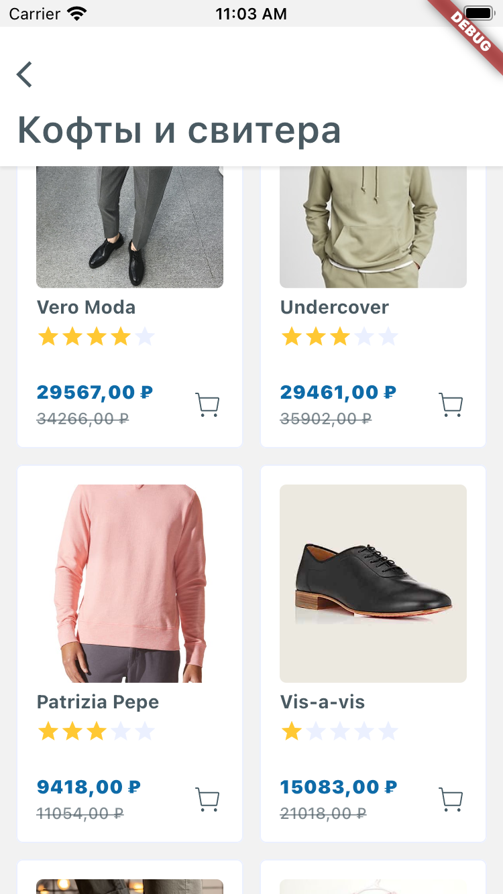
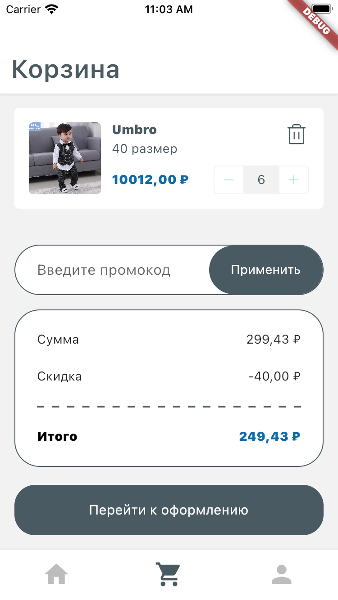
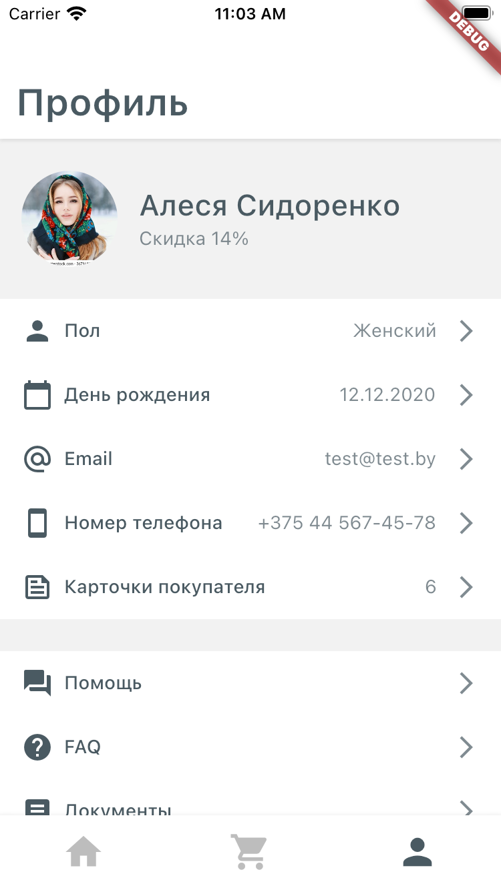
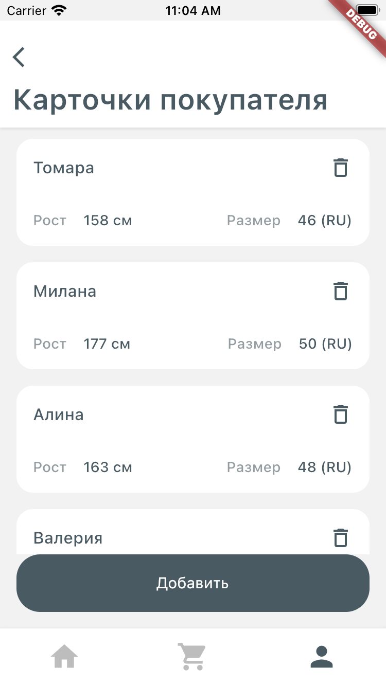
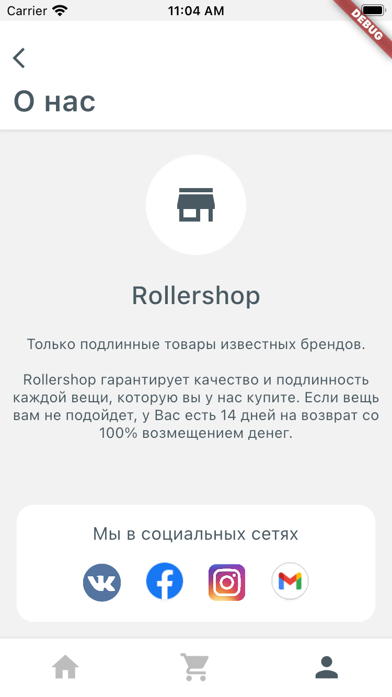

# Clothes store

Прототип шаблона магазина одежды для Хакатон 2021 @ Intervale - App Builder.

<b>Ключевые особенности:</b>
- На экране выбора категорий добавлен просмотр категорий с разным размером плиток
- Для просмотра конкретной категории реализован эмулятор названий, стоимости, скидки и изображений
- Реализован виджет пунктирной линии

## Демо

## Скриншоты

      
 
      

## Платформа:
- Android
- iOS

## Окружение
- Dart: 2.14.0
- flutter: 2.5.0

## Пакеты
- flutter_svg
- url_launcher

## Об авторе
- [linkedin](https://www.linkedin.com/in/yauheni-prakapenka/)
- [stackoverflow](https://stackoverflow.com/users/11725354/yauheni-prakapenka)
