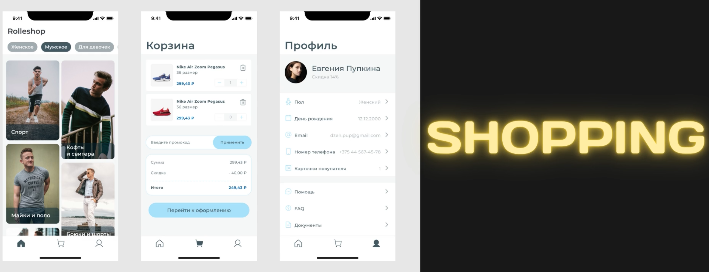

 
 

# Clothes store

> **UI:** Flutter v2.5.0 
**Язык:** Dart v2.14.0 
**Платформа:** Android, iOS 

Прототип шаблона магазина одежды для Хакатон 2021 @ Intervale - App Builder.

<b>Ключевые особенности:</b>
- На экране выбора категорий добавлен просмотр категорий с разным размером плиток
- Для просмотра конкретной категории реализован эмулятор названий, стоимости, скидки и изображений
- Реализован виджет пунктирной линии

<b>Видео:</b>

 
 

<b>Скриншоты:</b>

